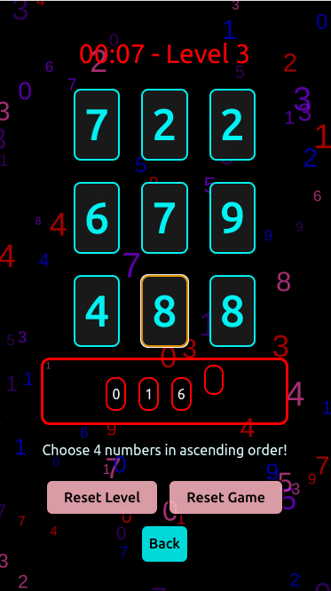
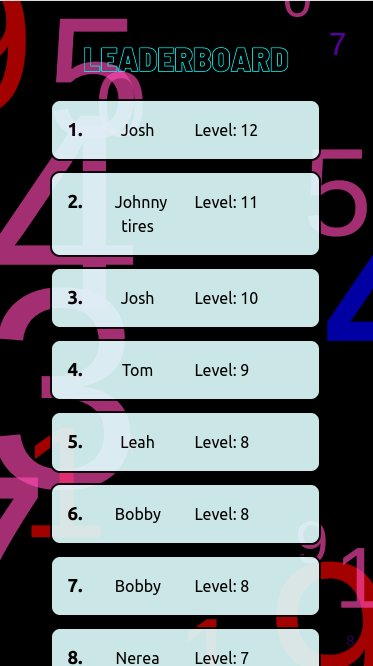

# Number Blast

Number Blast is an exciting number reaction game built in React with JavaScript, featuring stunning particle styling effects using the tsparticles library and powered by Firebase for the backend. Test your reflexes and number skills by playing this addictive game!

## Demo

You can play Number Blast live [here](https://number-blast.netlify.app/).

## Screenshots





## Table of Contents

- [Installation](#installation)
- [Firebase Setup](#firebase-setup)
- [Screenshots](#screenshots)
- [Author](#author)

## Installation

To get a local copy of the project up and running, follow these steps:

  1. Clone the GitHub repository:

   ```
  git clone https://github.com/DanielCouperthwaite/number-blast.git
   ```

  2. Navigate to the project directory:
    
  ```
  cd number-blast
  ```

  3. Install the project dependencies using npm:
    
  ```
  npm install
  ```

  4. Start the development server:
    
  ```
  npm start
  ```

  Open your web browser and visit http://localhost:3000 to play the game locally.

## Firebase Setup
    
 To set up your own Firebase backend for this project, follow these steps:
    
1. Create a Firebase project on the [Firebase Console](https://console.firebase.google.com/).
    
2. Copy your Firebase configuration object from your Firebase project settings.
    
3. Create a `.env` file in the project root and add your Firebase configuration as follows:
    
       
       VITE_API_KEY=YOUR_API_KEY
       

4. Replace YOUR_API_KEY with the actual value from your Firebase project.

5. Restart your development server:

    ```
    npm start
    ```
    
Now, your app should be connected to your Firebase backend.
    
## Author

Thanks for dropping by! You can find out more about me in the links below, or find information about my other hosted projects!
    
- Daniel Couperthwaite
- Portfolio: [danielcouperthwaite.tech](https://danielcouperthwaite.tech/)
- LinkedIn: [Daniel Couperthwaite](https://www.linkedin.com/in/daniel-couperthwaite-209290139/)

